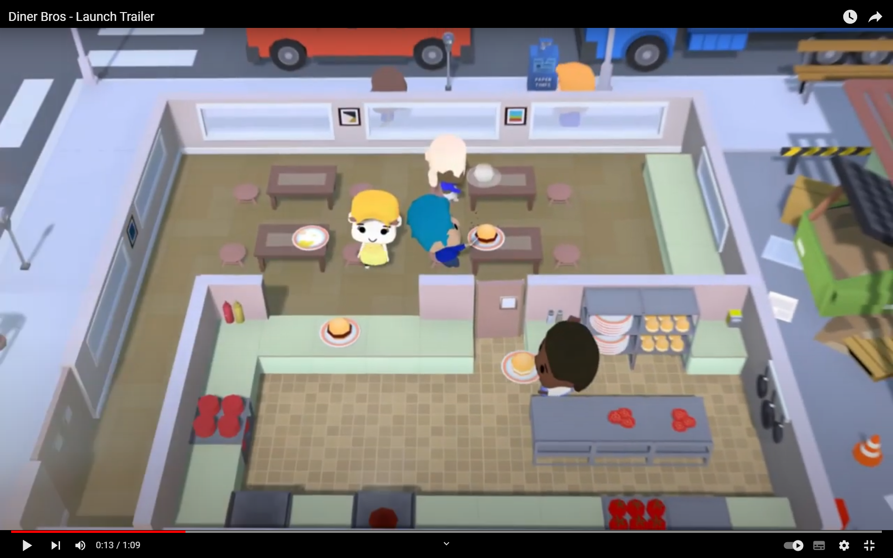

# 프로젝트명: restaurant(이창준)

><목차>

1. [게임명:restaurant]
2. [컨셉](#컨셉)
3. [관련이미지 & 동영상](#관련-이미지--동영상)
4. [대표이미지](#대표-이미지)
5. [컨셉 & 대표이미지 기반 작품묘사](#컨셉--대표이미지-기반-작품묘사)
6. [rolling dice 구성요소](#구성-요소)
7. [게임 시스템 디자인](#게임-시스템-디자인)
8. [개발 요구사항 & 흐름도](#개발-요구사항--흐름도)
9. [스토리보드](#스토리보드)
10. [프로토타입 개발 요구사항](#프로토타입-개발-요구사항)
11. [프로토타입 개발 작업일정](#프로토타입-개발-작업일정)
12. [프로토타입 주차별 구현내용](#프로토타입-주차별-구현내용)

# [컨셉]

## 메인컨셉 : 식당

### 서브 컨셉 1 : 요리
- 
### 서브 컨셉 2 : 서빙

### 서브 컨셉 3 : 

### 서브 컨셉 4 : 

### 서브 컨셉 5 :

  

# [관련 이미지 & 동영상]

- 이미지
  
- 동영상
  (https://youtu.be/_8RMDXGxf_M)

  

# [대표 이미지]

  

# [컨셉 & 대표이미지 기반 작품묘사]

> ### 대표이미지 기반 : 

> ### 컨셉 기반: 

  

# [구성 요소]

- 

 

## 1. 메커니즘

[도전 과제]

[재미 요소]

 

## 2. 이야기

[만들게 된 배경]

[카메라 관점]

 

## 3. 미적요소

[디자인][컬러]  

[음향]  

 

## 4. 기술

unity 기반으로 pc플랫폼으로 개발할 예정입니다.

# [게임 시스템 디자인]

1.게임 오브젝트 분해

2.파라미터(속성)

3.행동

4.상태

5.플레이어 캐릭터 속성(파라미터)

6.게임의 규칙

7.게임에서 사용될 공식

# [개발 요구사항 & 흐름도]
  1.요구사항
    
  2.키보드 이벤트에 대한 흐름도
  
  
  
  3.용어정리
  
# [스토리보드]
  
  
# [프로토타입 개발 요구사항]

1주차 :  고기 빵 제작 및 굽기 기능
플레이어 이동 구현
2주차 : 
익은 고기와 빵 합치면 햄버거 제작
손님 및 주문 시스템 구현
고기 굽는 타이머 제작

3주차 : 양배추와 토마토 추가 
도마 제작
양배추와 토마토 넣은 햄버거 제작

4주차 : 

5주차 : 

6주차 : 

## [프로토타입 개발 작업일정]

## [프로토타입 주차별 구현내용]

# 1주차 : 
고기 빵 제작 및 굽기 기능
플레이어 이동 구현

  
# 2주차 :
# 3주차 :
# 4주차 :
# 5주차 : 
# 6주차 : 
      
